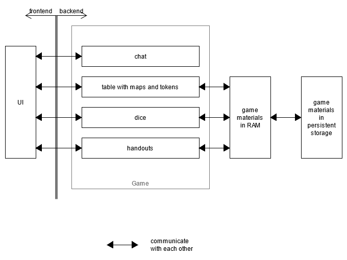

# Basic architecture of the backend

## In game

The aspects of a running game (maps and tokens, handouts, dice, chat, ...) are separate parts of the application. They
are integrated together in the UI frontend.

The parts that need access to the *GMs* game materials also access the persistent layers.

