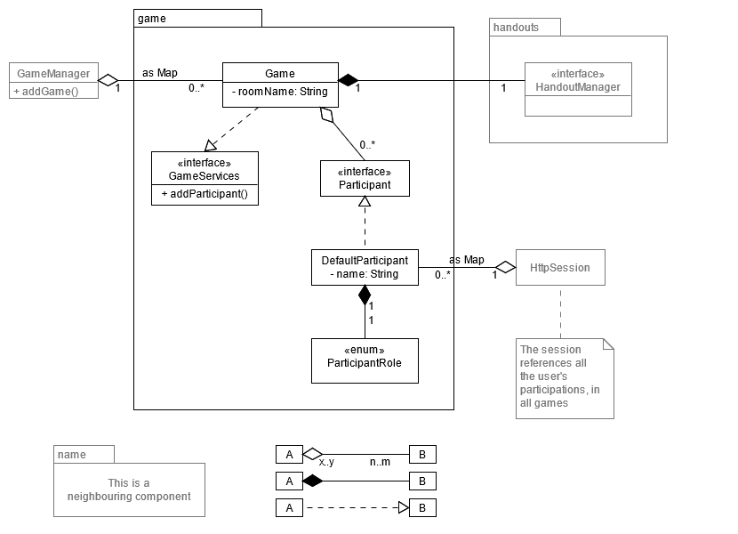
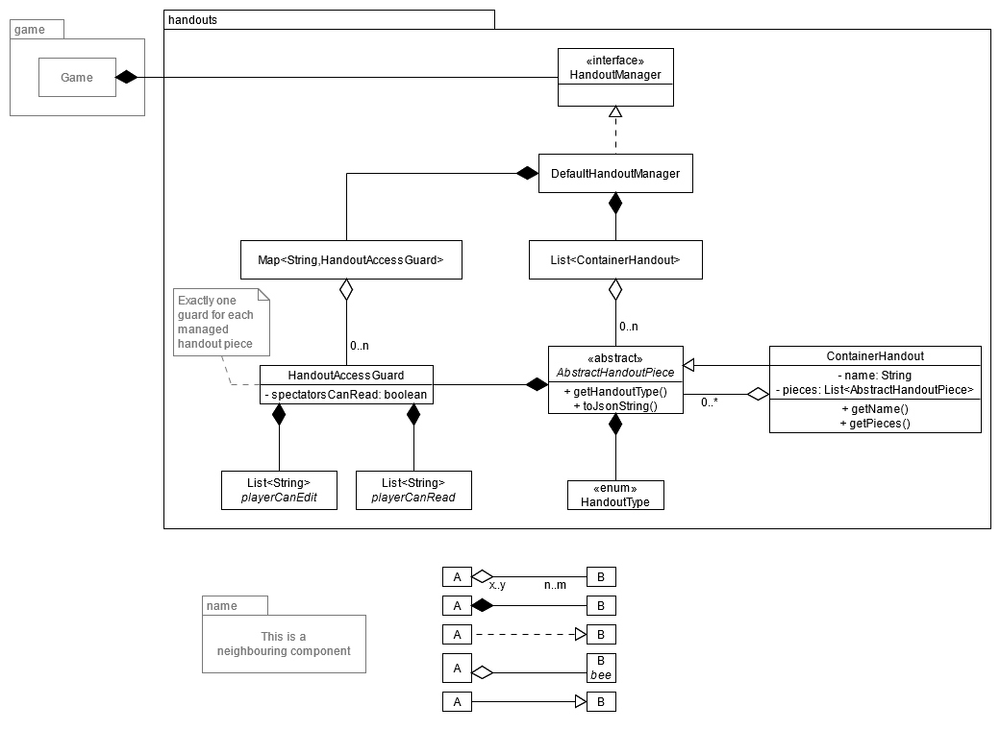

This chapter highlights the static code structure. It shows how classes are grouped to components, how components are
grouped to larger components. It also displays how classes and components are related and linked to each other.

# Top level structore

tbd

# Second level structure

## Package "game"

## Package "handouts"

## Further: tbd
